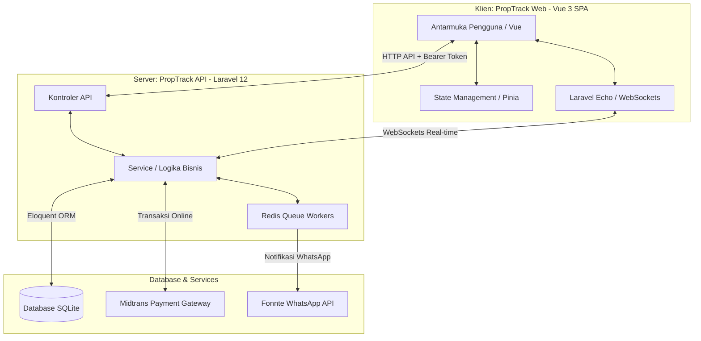

# 🏢 PropTrack — Platform Manajemen Properti Kelas Enterprise

PropTrack adalah **platform manajemen properti dengan arsitektur terpisah (decoupled)** yang dibangun menggunakan teknologi modern. Aplikasi ini menyediakan antarmuka yang mulus dan pengalaman real-time untuk tiga tipe pengguna:

*   **Pemilik & Admin (Owners & Admins)** — Mengawasi portofolio properti, menyusun kontrak sewa, mengelola invoice tagihan, memantau keuangan platform, dan menugaskan agen dukungan.
*   **Agen Dukungan (Support Agents)** — Mengelola tiket keluhan dan pemeliharaan dari penghuni, memperbarui status tiket, dan membalas pesan dalam utas obrolan.
*   **Penyewa (Tenants)** — Meninjau detail sewa aktif, mengunduh dokumen resmi kontrak PDF bilingual, membayar sewa bulanan secara aman secara online, dan mengirimkan tiket keluhan.

---

## 🎯 Masalah & Solusi (Problem & Solution)

### Deskripsi Masalah (The Problem)
Manajemen properti tradisional (seperti rumah kos, apartemen, atau ruko) sering kali terhambat oleh proses manual yang tidak efisien:
*   **Verifikasi Pembayaran Manual**: Pemilik harus memeriksa mutasi rekening bank secara berkala untuk mencocokkan pembayaran sewa penyewa, yang rawan keterlambatan dan kesalahan pencatatan.
*   **Kontrak Tidak Terpusat**: Dokumen perjanjian sewa sering tercecer, sulit dipantau masa berlakunya, dan sulit diakses secara instan oleh penyewa maupun pemilik.
*   **Saluran Komunikasi Keluhan Tersebar**: Keluhan kerusakan properti diajukan lewat chat personal (WhatsApp/SMS), sehingga sulit dipantau perkembangannya dan tidak terarsip dengan baik.
*   **Laporan Finansial yang Lambat**: Pemilik kesulitan menghitung tingkat pendapatan bersih, rasio penagihan (*collection rate*), dan outstanding invoice secara instan.

### Solusi PropTrack (The Solution)
PropTrack mengatasi tantangan tersebut dengan menghadirkan solusi digital **Enterprise-Grade** satu pintu:
1.  **Konfirmasi Pembayaran Instan 24/7**: Integrasi *Midtrans Snap API* memfasilitasi transaksi online (Virtual Account, E-Wallet, Kartu Kredit) dengan konfirmasi otomatis seketika melalui Webhook yang aman.
2.  **Manajemen Kontrak Terpusat & Otomatis**: Sistem menerapkan aturan bisnis secara ketat (misal: *hanya satu kontrak aktif per properti*) serta menerbitkan draf kontrak bilingual (Indonesia/Inggris) berwujud PDF secara otomatis.
3.  **Sistem Tiket Keluhan Real-time**: Keluhan penyewa dikonsolidasikan dalam sistem tiket bantuan dengan penomoran unik thread-safe. Agen dukungan dan penyewa dapat berinteraksi secara interaktif di dalam utas komentar yang diperbarui secara langsung melalui WebSockets.
4.  **Analisis Keuangan Instan**: Dasbor analitik interaktif menghitung keseluruhan data tagihan bulanan dan menampilkan tren performa keuangan portofolio properti dalam bentuk grafik intuitif.

---

## 🏗️ Arsitektur Sistem Sederhana (Simple Architecture)

PropTrack dirancang dengan arsitektur terpisah (*fully decoupled*) untuk menjamin kinerja yang cepat, keamanan data, dan fleksibilitas pengembangan:



---

## 🏗️ Arsitektur Terpisah (Decoupled Architecture)

PropTrack dirancang sebagai aplikasi client-server yang terpisah secara ketat. Semua komunikasi terjadi melalui HTTP/JSON API terstruktur yang diamankan dengan Laravel Sanctum Bearer Token.

```
proptrack/
├── proptrack-api/    ← RESTful API (Laravel 12, PHP 8.4)
└── proptrack-web/    ← Single Page Application (Vue 3, Vite, TypeScript)
```

### Stack Teknologi & Paket Utama

#### Backend (`proptrack-api`)
*   **Core**: Laravel 12 / PHP 8.4 REST API
*   **Autentikasi**: Laravel Sanctum (autentikasi berbasis token bearer)
*   **RBAC (Role-Based Access Control)**: Spatie Permission (`admin`, `owner`, `agent`, `tenant`)
*   **Media**: Spatie Media Library (unggah foto untuk properti)
*   **Pembuatan PDF**: Spatie Laravel PDF v2.8.0 (kontrak, invoice, laporan)
*   **Real-time & WebSockets**: Laravel Reverb + driver cache & antrean (queue) Redis
*   **Pemantauan Antrean**: Pengelola antrean Laravel Horizon
*   **Pengujian**: Pest PHP v3

#### Frontend (`proptrack-web`)
*   **Core**: Vue 3 (Composition API) + Router 4 + Pinia (Manajemen State)
*   **Desain & Gaya**: Vanilla CSS modern dengan HSL CSS Custom Properties
*   **Peta**: Vue Leaflet (peta interaktif pada halaman detail properti)
*   **Build Tool**: Vite 6 + TypeScript (Strict Mode)
*   **Klien API**: Axios (dikonfigurasi dengan injeksi token bearer global dan penanganan otomatis untuk `401 Unauthorized` / `422 Unprocessable Entity`)

---

## 🌟 Daftar Fitur (Feature Checklist)

- [x] **Autentikasi Aman**: Pinia + persistensi token `localStorage`, pembaruan profil otomatis, dan pelindung rute (router guards).
- [x] **Portofolio Properti**: CRUD lengkap, pemetaan koordinat dengan peta Leaflet interaktif (geocoding + reverse geocoding), dan galeri unggah foto properti.
- [x] **Direktori Penyewa**: Database penghuni lengkap dengan verifikasi KTP Indonesia 16 digit (termasuk penghitung digit langsung/live counter) dan penyembunyian privasi digit tengah KTP (privacy masking).
- [x] **Kontrak Sewa (Rental Agreements)**: Kontrak sewa bilingual (Bahasa Indonesia & Inggris). Menerapkan aturan bisnis (contoh: *hanya satu kontrak aktif per properti*) dan batasan pilihan tanggal jatuh tempo (tanggal 1–28).
- [x] **Penagihan & Invoice**: Pembuatan invoice otomatis setiap bulan dengan ekspor PDF premium dan lencana navigasi jatuh tempo (overdue).
- [x] **Gerbang Pembayaran (Payment Gateway)**: Proses pembayaran yang mulus mengintegrasikan **modal Midtrans Snap API** untuk transaksi online yang aman secara real-time.
- [x] **Analisis Keuangan**: Dasbor interaktif dengan grafik batang analisis 12 bulan (vue-chartjs), agregasi metrik keuangan, dan ekspor laporan ke format PDF/CSV.
- [x] **Sistem Tiket Keluhan**: Konsol resolusi keluhan yang memungkinkan transisi status (`Open` $\rightarrow$ `In Progress` $\rightarrow$ `Resolved` $\rightarrow$ `Closed`), klaim tiket oleh agen, dan utas komentar kronologis.
- [x] **Pengaturan Profil Pengguna**: Formulir detail pribadi dan pengubahan kata sandi dengan kontrol pengiriman lokal serta tombol mata untuk menampilkan/menyembunyikan sandi secara aman.
- [x] **WebSocket Real-time**: Penyiaran event Laravel Reverb (`NotificationSent`, `TicketStatusUpdated`, `PaymentConfirmed`) langsung ke pengguna aktif.
- [x] **Notifikasi Multi-saluran**: Lansiran lonceng notifikasi navigasi (navbar bell) secara real-time dan notifikasi database.

---

## 🚀 Panduan Memulai

### Prasyarat
*   PHP 8.4+ & Composer
*   Node.js 20+ & npm
*   SQLite / MySQL
*   Redis server (untuk antrean & WebSockets)

### 1. Konfigurasi Backend (`proptrack-api`)
```bash
cd proptrack-api
composer install

# Konfigurasi Environment
cp .env.example .env
php artisan key:generate

# Migrasi Database & Seeding
# Perintah ini akan melakukan migrasi segar dan mengisi database dengan role default, akun dasar, 
# dan kumpulan data dunia nyata fidelitas tinggi (properti, kontrak, lini masa, tiket, komentar, dan notifikasi) untuk inspeksi langsung:
# Akun yang disediakan:
# - admin@proptrack.com / owner@proptrack.com / agent@proptrack.com / tenant@proptrack.com (kata sandi: 'password')
# - tenant2@proptrack.com / tenant3@proptrack.com (kata sandi: 'password')
php artisan migrate:fresh --seed

# Jalankan Server Pengembangan Lokal
php artisan serve # Berjalan di http://localhost:8000

# Jalankan Queue Worker (untuk pembuatan PDF dan notifikasi)
php artisan queue:work
```

### 2. Konfigurasi Frontend (`proptrack-web`)
```bash
cd proptrack-web
npm install

# Konfigurasi Environment
cp .env.example .env
# Pastikan VITE_API_URL diarahkan ke http://localhost:8000

# Jalankan Server Pengembangan Vite
npm run dev # Berjalan di http://localhost:5173
```

### 3. Akun & Kredensial Pengujian (Test Accounts)

Setelah menjalankan database seeder, Anda dapat masuk ke aplikasi menggunakan akun-akun simulasi berikut berdasarkan perannya (*role-based access control*):

| Peran (Role) | Email | Kata Sandi | Deskripsi Hak Akses |
| :--- | :--- | :--- | :--- |
| **Administrator** | `admin@proptrack.com` | `password` | Akses penuh ke seluruh sistem, portofolio properti, penyewa, & kontrak |
| **Pemilik (Owner)** | `owner@proptrack.com` | `password` | Mengelola properti & kontrak miliknya, melihat analisis keuangan |
| **Agen Dukungan** | `agent@proptrack.com` | `password` | Mengklaim, memperbarui status, dan merespons tiket keluhan penyewa |
| **Penyewa Utama** | `tenant@proptrack.com` | `password` | Meninjau kontrak aktif, membayar sewa (Midtrans), & mengirim keluhan |
| **Penyewa Tambahan 1** | `tenant2@proptrack.com` | `password` | Simulasi akun penyewa sekunder |
| **Penyewa Tambahan 2** | `tenant3@proptrack.com` | `password` | Simulasi akun penyewa tersier |

---

## 🧪 Pengujian & Verifikasi

PropTrack mempertahankan standar ketat untuk kebenaran kode dan keunggulan visual.

### Uji Fitur & Unit Backend
Menjalankan seluruh rangkaian pengujian backend:
```bash
cd proptrack-api
php artisan test
```
*Status saat ini: **134/134 pengujian berhasil** (30 uji properti, 19 uji penyewa, 15 uji kontrak, 16 uji invoice, 16 uji pembayaran, 8 uji laporan, 9 uji tiket, 8 uji notifikasi, 6 uji penyiaran/broadcasting, dan 7 uji autentikasi/pembaruan profil).*

### Build Produksi Frontend
Validasi keamaan tipe data (type safety) dan kompilasi bundle:
```bash
cd proptrack-web
npm run build
```
*Vite berhasil mengompilasi **tanpa ada error dan tanpa peringatan TypeScript**.*

### Pengujian E2E Visual & Integrasi
Menggunakan simulasi otomatis Playwright (`run-ui-tests.js`), kami menjalankan skenario pengujian yang mencakup:
1. **Pemilik Properti (Owner)** masuk, membuat properti, mendaftarkan penyewa, dan membuat kontrak sewa.
2. **Penyewa (Tenant)** masuk, melihat dasbor pribadi mereka, dan mengirimkan tiket keluhan AC bocor.
3. **Agen (Agent)** mengklaim tiket tersebut, mengubah status menjadi *In Progress*, dan membalas komentar penyewa.

Tangkapan layar kemajuan visual diambil dan diverifikasi untuk memastikan kualitas antarmuka premium di dalam workspace.

---

## 🎨 Sistem Desain & Estetika

PropTrack menonjol dengan **antarmuka warna krem-hangat (warm-cream) terang yang sangat disesuaikan dan visual yang menawan**:
*   Variabel HSL terkurasi yang memetakan kedalaman (latar belakang luar `#eaece7` dengan permukaan kartu `#ffffff` yang bersih).
*   Sorotan merek dinamis menggunakan variabel amber (`var(--amber)`) untuk fokus tindakan kontras tinggi.
*   Tipografi modern menggunakan Google Font `Outfit` sebagai pengganti bawaan browser.
*   Tata letak responsif dengan lapisan glassmorphism dan mikro-animasi hover yang mulus untuk menjaga dasbor tetap interaktif dan hidup.
