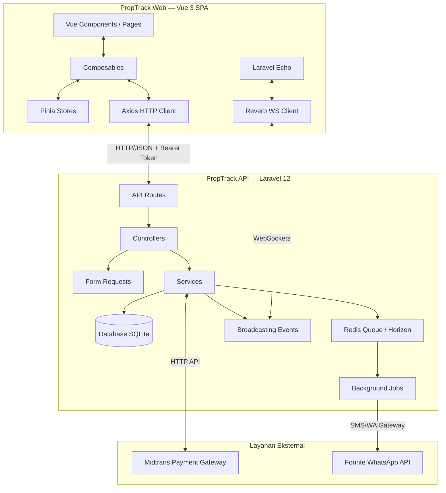
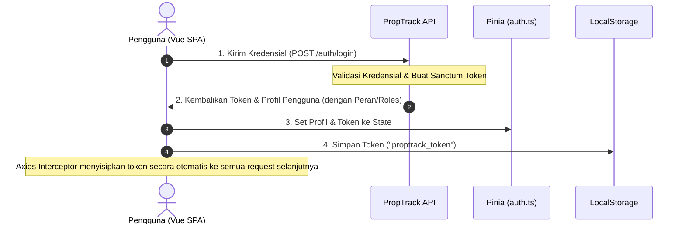
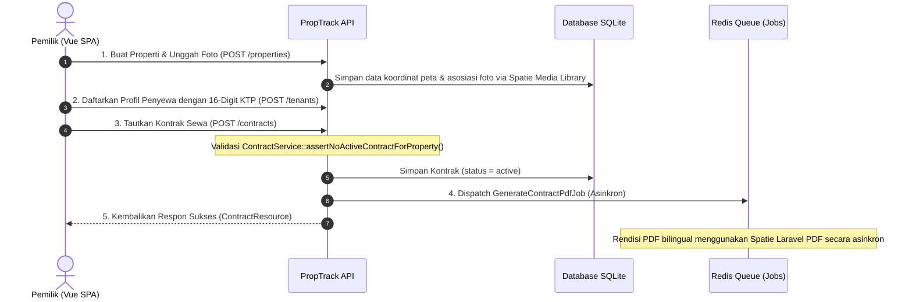
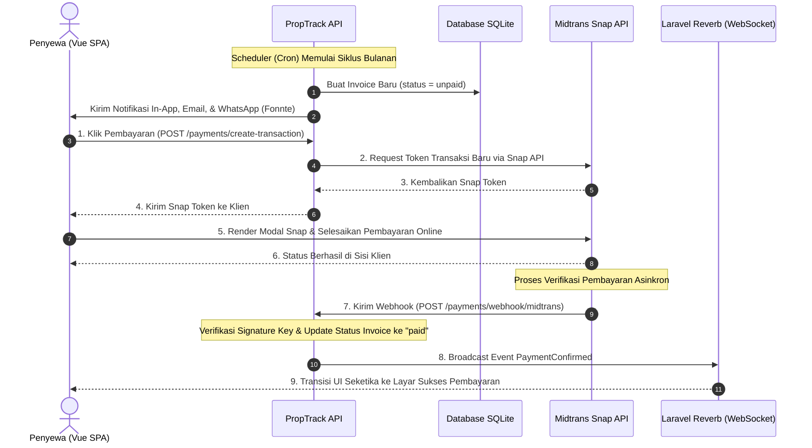
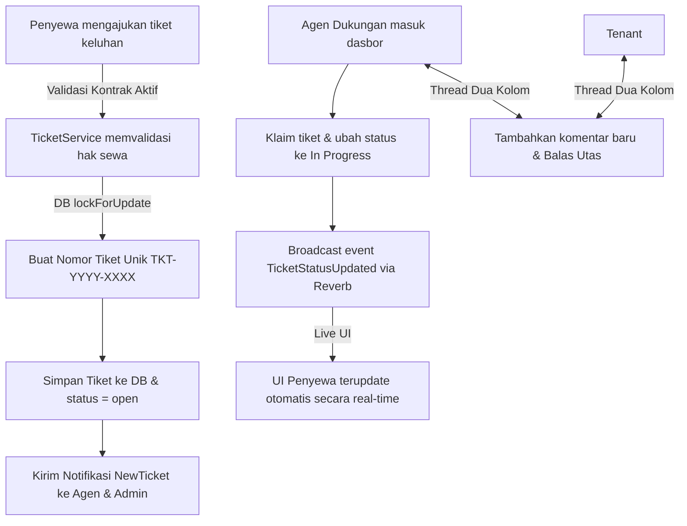

# 🏢 Dokumentasi Alur Aplikasi PropTrack

Dokumen ini menjelaskan arsitektur sistem, siklus hidup data (*data lifecycle*), alur kerja (*workflow*) end-to-end secara komprehensif, serta mekanisme teknis di balik layar pada platform PropTrack.

---

## 🏗️ 1. Arsitektur Komunikasi Terpisah (Decoupled Architecture)

PropTrack menggunakan arsitektur client-server terpisah secara penuh (*fully decoupled*). Interaksi antar komponen didesain sebagai berikut:



### Aturan Komunikasi Utama:
1.  **Autentikasi Stateless**: Tidak ada session berbasis cookie di sisi server. Otentikasi menggunakan **Laravel Sanctum Bearer Token** yang disimpan secara lokal dan dikirimkan secara otomatis di setiap *request* melalui Axios Interceptor.
2.  **Pola Delegasi Bisnis**:
    $$\text{Controller} \longrightarrow \text{FormRequest (Validasi)} \longrightarrow \text{Service (Logika Bisnis)} \longrightarrow \text{Resource (JSON Wrapper)}$$

### Penjelasan Teknis Alur Arsitektur:
*   **Decoupled HTTP/JSON API**: Klien frontend (`proptrack-web`) tidak pernah mengakses database atau merender file di sisi server (*No SSR/Inertia*). Semua komunikasi berjalan murni di atas protokol HTTP menggunakan berkas JSON terstruktur.
*   **WebSockets Real-time**: Komunikasi dua arah didukung secara real-time melalui **Laravel Reverb**. Kejadian penting di sisi server (seperti notifikasi masuk atau perubahan transaksi pembayaran) disiarkan (*broadcasted*) secara instan ke peramban penyewa atau pemilik yang sedang aktif.

---

## 🔑 2. Alur Autentikasi & Otorisasi (RBAC)

PropTrack mendukung kontrol akses berbasis peran (*Role-Based Access Control* - RBAC) menggunakan paket **Spatie Permission**. Peran pengguna terdiri dari: `admin`, `owner` (pemilik), `agent` (agen dukungan), dan `tenant` (penyewa).



### Penjelasan Teknis Alur Autentikasi:
*   **Penerbitan Token**: Saat formulir login disubmit, kredensial dikirimkan ke `/api/v1/auth/login`. Jika valid, Laravel Sanctum membuat rekaman token bearer unik di database dan mengembalikannya ke klien bersama informasi profil pengguna serta perannya.
*   **Persistensi Token Lokal**: Di sisi frontend, composable `useAuth` menyimpan token di **Pinia Store (`auth.ts`)** dan mencadangkannya di **`localStorage`** dengan kunci `proptrack_token`. Ini memastikan sesi tetap aktif bahkan jika halaman direfresh (*hard refresh*).
*   **Injeksi Axios Global**: Plugin Axios (`src/plugins/axios.ts`) dikonfigurasi secara terpusat untuk menyisipkan tajuk `Authorization: Bearer <token>` pada setiap *HTTP request*. Klien Axios juga dibekali kemampuan menangani status `401 Unauthorized` secara global dengan menghapus token lokal dan mengarahkan pengguna kembali ke halaman login.
*   **Validasi Keamanan Berlapis**: Pelindung navigasi (*router guards*) di frontend bertugas mengatur visibilitas halaman secara visual, namun backend Laravel tetap menjadi **sumber kebenaran otorisasi utama** menggunakan **Laravel Policies** sebelum mengeksekusi operasi database apa pun.

---

## 📋 3. Alur Manajemen Properti, Penyewa, & Kontrak

Aturan bisnis krusial: **Satu properti hanya boleh memiliki maksimal satu kontrak sewa yang aktif secara bersamaan.**



### Penjelasan Teknis Alur Kontrak & Data:
*   **Manajemen Properti & Media**: Pemilik menambahkan properti beserta koordinat peta interaktif (Leaflet). Foto properti diunggah dan dikelola secara rapi menggunakan **Spatie Media Library**, yang menangani konversi ukuran gambar secara otomatis di server.
*   **Verifikasi Penyewa**: Pemilik mendaftarkan penyewa dengan nomor KTP Indonesia 16 digit. Frontend menampilkan penghitung digit dinamis (*live counter*) dan menyembunyikan digit tengah KTP (*privacy masking*) demi menjaga privasi data kependudukan.
*   **Pengaman Konflik Kontrak (Guard)**: Sebelum kontrak disimpan ke database, `ContractService` memanggil metode `assertNoActiveContractForProperty()`. Kueri ini memverifikasi bahwa properti tersebut tidak sedang dihuni oleh penyewa lain dengan status kontrak `active`. Jika ditemukan kontrak aktif, sistem melempar `ValidationException` (status 422) untuk membatalkan proses.
*   **Rendisi PDF Bilingual Asinkron**: Pembuatan berkas PDF kontrak resmi berbahasa ganda (Bahasa Indonesia & Inggris) memerlukan sumber daya server yang intensif. Oleh karena itu, Laravel memasukkan proses ini ke antrean latar belakang (**`GenerateContractPdfJob`**) menggunakan driver Redis. *Queue worker* akan memproses pekerjaan ini secara asinkron untuk merender PDF menggunakan **Spatie Laravel PDF v2.8.0** tanpa mengganggu kecepatan respon aplikasi bagi pemilik properti.

---

## 💳 4. Alur Penagihan Bulanan & Gerbang Pembayaran (Midtrans)

Setiap bulan, sistem membuat tagihan sewa baru untuk setiap penyewa aktif. Pembayaran diintegrasikan secara aman menggunakan **Midtrans Snap API**.



### Penjelasan Teknis Alur Invoice & Pembayaran:
*   **Pembuatan Invoice Otomatis**: Secara berkala (atau dipicu manual), scheduler mencari semua kontrak aktif untuk bulan penagihan bersangkutan (format `YYYY-MM`), membuat record invoice berstatus `unpaid`, dan mengirimkan notifikasi database serta tautan tagihan instan melalui WhatsApp menggunakan **Fonnte API**.
*   **Permintaan Transaksi Snap**: Ketika penyewa menekan tombol bayar, aplikasi frontend memanggil `/payments/create-transaction`. Di backend, `PaymentService` mengirim informasi nominal tagihan ke server Midtrans untuk mendapatkan **Snap Token**. Token rahasia ini dikembalikan ke frontend untuk meluncurkan modal integrasi pembayaran Midtrans (*Midtrans Snap Modal*) langsung di atas halaman web SPA.
*   **Verifikasi Webhook Midtrans & Keamanan**: Setelah penyewa menyelesaikan pembayaran (melalui GoPay, VA, Kartu Kredit, dll.), server Midtrans secara mandiri dan asinkron mengirimkan HTTP POST (*Webhook*) ke backend (`POST /api/v1/payments/webhook/midtrans`). Kontroler memproses sinyal ini, memverifikasi keaslian **Signature Key** (SHA-512) dengan Server Key lokal untuk mencegah pemalsuan status bayar, lalu memperbarui status invoice menjadi `paid` beserta waktu pembayarannya.
*   **WebSocket Update Instan**: Segera setelah database diperbarui, backend menyiarkan event `PaymentConfirmed` via **Laravel Reverb**. Halaman web Vue SPA penyewa yang aktif mendengarkan *private channel* Websocket tersebut akan menangkap event ini dan melakukan transisi antarmuka seketika ke halaman sukses (`PaymentStatus.vue`) tanpa perlu memuat ulang peramban secara manual.

---

## 🛠️ 5. Alur Tiket Keluhan & Thread Komentar

Penyewa yang mengalami kendala teknis (seperti AC rusak, kebocoran, dll.) dapat mengajukan tiket bantuan yang akan diproses secara real-time oleh agen dukungan.



### Penjelasan Teknis Alur Tiket Keluhan:
*   **Pencegahan Duplikasi Kode Tiket (Race Condition)**: Tiket keluhan diberi nomor unik berurutan berformat `TKT-YYYY-XXXX`. Untuk menjamin keunikan nomor jika beberapa penyewa membuat tiket bantuan secara bersamaan, database diinstruksikan melakukan penguncian baris (`lockForUpdate()`) saat mengambil urutan tiket terakhir dalam transaksi database SQL. Langkah ini mencegah duplikasi nomor tiket (*race condition*).
*   **Sistem Notifikasi dan Klaim**: Ketika keluhan masuk, sistem mengirim notifikasi real-time ke dasbor Admin dan Agen Dukungan. Agen dapat langsung mengklaim keluhan tersebut dan mengubah status tiket (`open` -> `in_progress`). Perubahan status ini segera disiarkan via Laravel Reverb sehingga UI di peramban penyewa terupdate secara live.
*   **Percakapan Live Utas Komentar**: Penyewa dan agen dapat berdiskusi melalui utas obrolan dua kolom interaktif. Setiap kali komentar baru disubmit, backend menyimpan data dan menyiarkannya di saluran privat WebSocket `private-ticket.{ticketId}`. Ini memicu penambahan komentar secara instan di sisi lawan bicara layaknya sistem aplikasi chat modern.

---

## 📈 6. Alur Pelaporan Keuangan Pemilik (Financial Report)

Pemilik dapat memantau produktivitas investasi properti mereka melalui visualisasi dasbor interaktif.

```
+-------------------------------------------------------------------------+
|                              REPORT SERVICE                             |
|                                                                         |
|  1. Ambil semua invoice aktif (Kecuali status = cancelled)              |
|  2. Terapkan filter berdasarkan Peran (Owner hanya melihat properti     |
|     miliknya, Admin melihat keseluruhan)                                |
|  3. Terapkan filter periode tanggal tahun/bulan                        |
|  4. Kalkulasi metrik agregat secara efisien (Helper: calculateMetrics)   |
|  5. Kelompokkan berdasarkan properti untuk data sebaran                 |
|  6. Format data terstruktur dikembalikan melalui ReportResource         |
+-------------------------------------------------------------------------+
                                   |
         +-------------------------+-------------------------+
         |                                                   |
         v                                                   v
[Grafik 12 Bulan (Vite/ChartJS)]                   [Ekspor PDF / CSV]
Visualisasi rasio koleksi, total             Rendisi asinkron template Blade
tagihan, & total uang terkumpul              menjadi dokumen PDF resmi.
```

### Penjelasan Teknis Pelaporan Finansial:
*   **Penyaringan Berbasis Peran (RBAC Scoping)**: Saat memuat data analitik keuangan, `ReportService` menyaring data invoice berdasarkan peran pengguna. Akun dengan peran `owner` dibatasi kuerinya oleh Eloquent agar hanya menarik invoice dari portofolio properti milik ID owner tersebut, sedangkan peran `admin` diberikan akses agregasi global ke seluruh sistem.
*   **Agregasi Cepat & Bersih (SOLID & DRY)**: Menggunakan fungsi pembantu `calculateMetrics()`, data nominal tagihan dijumlahkan berdasarkan status transaksinya secara efisien untuk mendapatkan data Total Tagihan (*total invoiced*), Total Uang Terkumpul (*total collected*), Tunggakan Outstanding (*total outstanding*), dan Rasio Koleksi (*collection rate*).
*   **Penyajian via Resource**: Data keuangan yang teragregasi tersebut dibungkus rapi melalui `ReportResource` sebelum dikembalikan ke klien. Ini menjamin keseragaman struktur JSON API dan keterpisahan logika pemrosesan dari representasi data.
*   **Ekspor Dokumen Fisik**: Pemilik dapat mengunduh berkas laporan dalam format PDF bilingual resmi yang dirender secara asinkron menggunakan pustaka rendisi PDF berbasis server untuk menjaga keandalan dan estetika desain dokumen cetak.

---

## 🏁 Ringkasan Siklus Hidup Alur Utama (End-to-End)

```
[Pemilik Properti]                     [Penyewa (Tenant)]                 [Agen / Admin]
       │                                       │                                │
       ├─► Buat Properti & Galeri Foto         │                                │
       ├─► Daftarkan Penyewa (KTP)             │                                │
       ├─► Tanda Tangan Kontrak Sewa ──────────┼───► Terima Email Kontrak (PDF) │
       │                                       │                                │
       ├─► (Siklus Bulanan / Cron)             │                                │
       │   Buat Tagihan Sewa Bulanan ──────────┼───► Terima Notifikasi In-app   │
       │                                       │     & WhatsApp Link Tagihan    │
       │                                       │                                │
       │                                       ├─► Bayar Tagihan (Midtrans Snap)│
       │                                       │   Konfirmasi Pembayaran        │
       │   Terima Laporan Analisis             │   Diterima secara Live         │
       │   Keuangan Update (Grafik/PDF) ◄──────┤                                │
       │                                       │                                │
       │                                       ├─► Kirim Tiket AC Rusak ───────►├─► Klaim Tiket
       │                                       │                                ├─► Set "In Progress"
       │                                       │   Terima Live Status Update ◄──┤
       │                                       │                                │
       │                                       ├─► Diskusi Utas Chat ◄─────────►├─► Balas Utas Chat
       │                                       │                                ├─► Selesaikan Tiket
       │                                       │   Terima Update Selesai ◄──────┤   (Ubah status -> Resolved)
```
