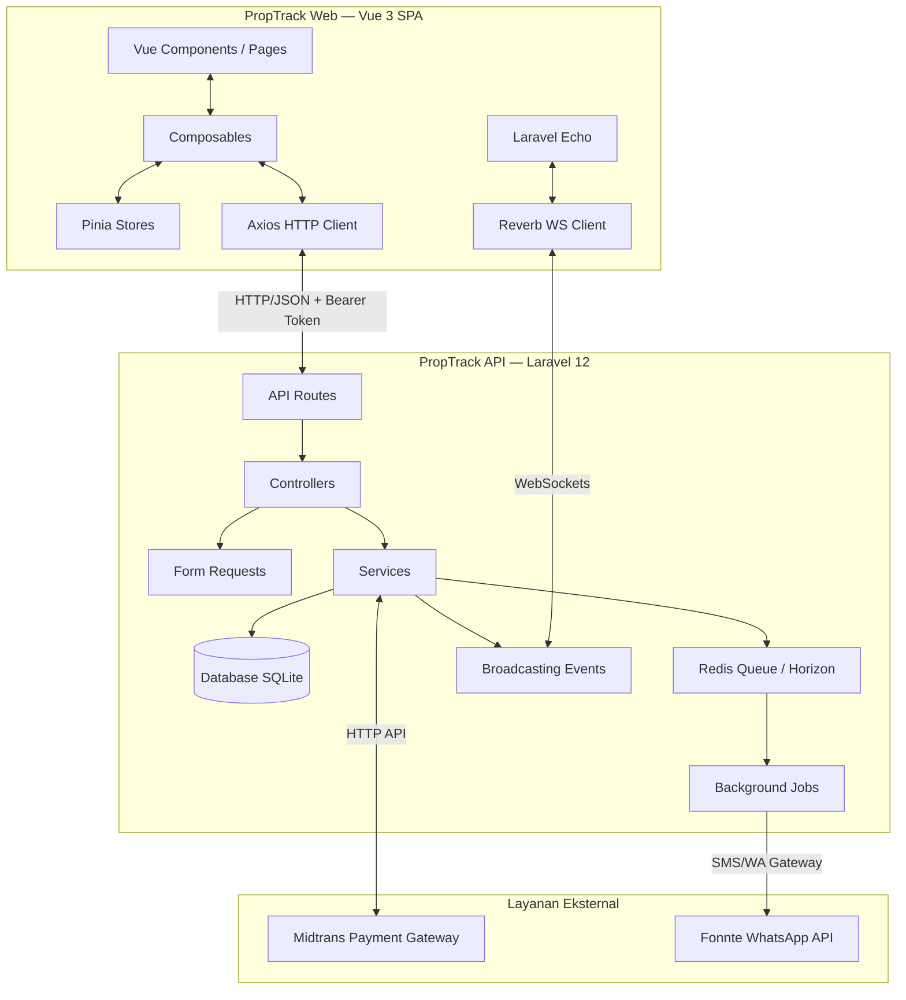
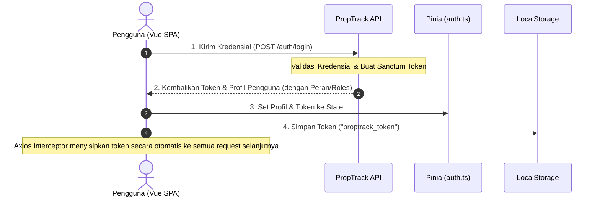
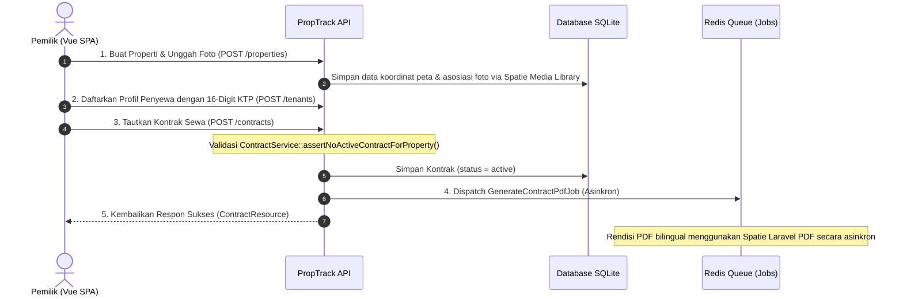
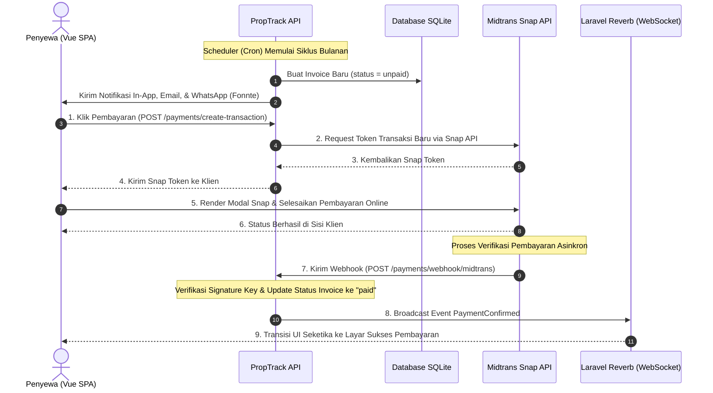
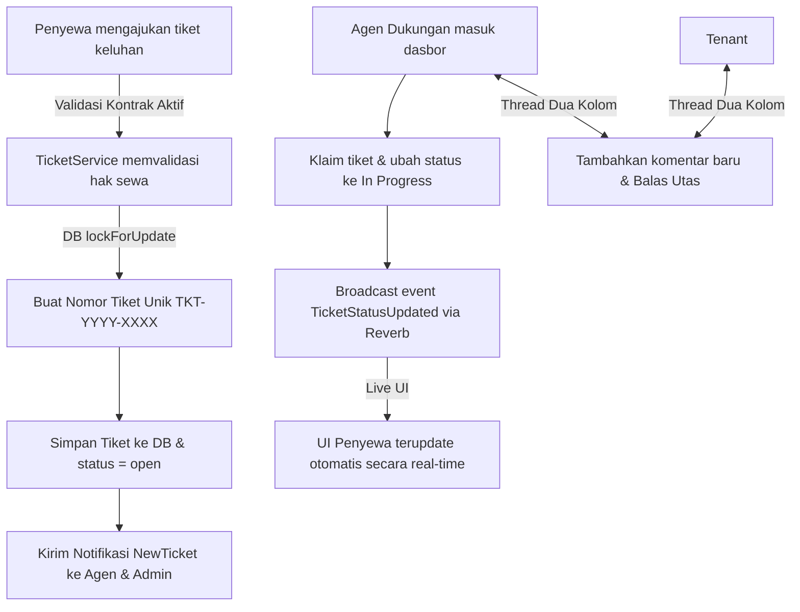

# 🏢 Dokumentasi Alur Aplikasi PropTrack

Dokumen ini menjelaskan arsitektur sistem, siklus hidup data (*data lifecycle*), dan alur kerja (*workflow*) end-to-end secara komprehensif pada platform PropTrack.

---

## 🏗️ 1. Arsitektur Komunikasi Terpisah (Decoupled Architecture)

PropTrack menggunakan arsitektur client-server terpisah secara penuh (*fully decoupled*). Interaksi antar komponen didesain sebagai berikut:



### Aturan Komunikasi Utama:
1. **Autentikasi Stateless**: Tidak ada session berbasis cookie di sisi server. Otentikasi menggunakan **Laravel Sanctum Bearer Token** yang dikirimkan secara otomatis di setiap *request* melalui Axios Interceptor.
2. **Pola Delegasi Bisnis**:
   $$\text{Controller} \longrightarrow \text{FormRequest (Validasi)} \longrightarrow \text{Service (Logika Bisnis)} \longrightarrow \text{Resource (JSON Wrapper)}$$

---

## 🔑 2. Alur Autentikasi & Otorisasi (RBAC)

PropTrack mendukung kontrol akses berbasis peran (*Role-Based Access Control* - RBAC) menggunakan paket **Spatie Permission**. Peran pengguna terdiri dari: `admin`, `owner` (pemilik), `agent` (agen dukungan), dan `tenant` (penyewa).



*   **Pencegahan Rute Frontend**: Rute Vue Router dilindungi oleh *navigation guards* di `src/router/index.ts` untuk mengarahkan pengguna non-autentikasi ke halaman `/login`.
*   **Sumber Kebenaran Otorisasi**: Validasi otorisasi selalu diverifikasi di sisi backend menggunakan **Laravel Policies** sebelum melakukan aksi database apa pun.

---

## 📋 3. Alur Manajemen Properti, Penyewa, & Kontrak

Aturan bisnis krusial: **Satu properti hanya boleh memiliki maksimal satu kontrak sewa yang aktif secara bersamaan.**



> [!IMPORTANT]
> Kontrak sewa harus bilingual (Bahasa Indonesia & Inggris), berisi rincian harga sewa, jumlah deposit, dan tanggal penagihan bulanan yang dibatasi dari tanggal 1 hingga 28 demi konsistensi perhitungan kalender.

---

## 💳 4. Alur Penagihan Bulanan & Gerbang Pembayaran (Midtrans)

Setiap bulan, sistem membuat tagihan sewa baru untuk setiap penyewa aktif. Pembayaran diintegrasikan secara aman menggunakan **Midtrans Snap API**.



*   **Pencegahan Inkonsistensi Pembayaran**: Penggunaan Webhook wajib diverifikasi keasliannya menggunakan *Signature Key* dari Midtrans sebelum database diperbarui untuk mencegah manipulasi status.
*   **Asinkronitas Laporan**: Setelah invoice dibayar, sistem memicu pembaharuan data analisis keuangan secara otomatis.

---

## 🛠️ 5. Alur Tiket Keluhan & Thread Komentar

Penyewa yang mengalami kendala teknis (seperti AC rusak, kebocoran, dll.) dapat mengajukan tiket bantuan yang akan diproses secara real-time oleh agen dukungan.



### Fitur Pengaman Integritas:
*   **Thread-Safety**: Penomoran tiket (`TKT-YYYY-XXXX`) dihitung di dalam transaksi database yang dikunci menggunakan kueri `lockForUpdate()` untuk mencegah kondisi balapan (*race condition*) ketika beberapa penyewa mengirim tiket bersamaan.
*   **Keamanan Saluran Chat**: Komunikasi utas keluhan disiarkan via *Private Channel* Websocket Laravel Reverb yang membutuhkan otorisasi Sanctum aktif.

---

## 📈 6. Alur Pelaporan Keuangan Pemilik (Financial Report)

Pemilik dapat memantau produktivitas investasi properti mereka melalui visualisasi dasbor interaktif.

```
+-------------------------------------------------------------------------+
|                              REPORT SERVICE                             |
|                                                                         |
|  1. Ambil semua invoice aktif (Kecuali status = cancelled)              |
|  2. Terapkan filter berdasarkan Peran (Owner hanya melihat properti     |
|     miliknya, Admin melihat keseluruhan)                                |
|  3. Terapkan filter periode tanggal tahun/bulan                        |
|  4. Kalkulasi metrik agregat secara efisien (Helper: calculateMetrics)   |
|  5. Kelompokkan berdasarkan properti untuk data sebaran                 |
|  6. Format data terstruktur dikembalikan melalui ReportResource         |
+-------------------------------------------------------------------------+
                                   |
         +-------------------------+-------------------------+
         |                                                   |
         v                                                   v
[Grafik 12 Bulan (Vite/ChartJS)]                   [Ekspor PDF / CSV]
Visualisasi rasio koleksi, total             Rendisi asinkron template Blade
tagihan, & total uang terkumpul              menjadi dokumen PDF resmi.
```

---

## 🏁 Ringkasan Siklus Hidup Alur Utama (End-to-End)

```
[Pemilik Properti]                     [Penyewa (Tenant)]                 [Agen / Admin]
       │                                       │                                │
       ├─► Buat Properti & Galeri Foto         │                                │
       ├─► Daftarkan Penyewa (KTP)             │                                │
       ├─► Tanda Tangan Kontrak Sewa ──────────┼───► Terima Email Kontrak (PDF) │
       │                                       │                                │
       ├─► (Siklus Bulanan / Cron)             │                                │
       │   Buat Tagihan Sewa Bulanan ──────────┼───► Terima Notifikasi In-app   │
       │                                       │     & WhatsApp Link Tagihan    │
       │                                       │                                │
       │                                       ├─► Bayar Tagihan (Midtrans Snap)│
       │                                       │   Konfirmasi Pembayaran        │
       │   Terima Laporan Analisis             │   Diterima secara Live         │
       │   Keuangan Update (Grafik/PDF) ◄──────┤                                │
       │                                       │                                │
       │                                       ├─► Kirim Tiket AC Rusak ───────►├─► Klaim Tiket
       │                                       │                                ├─► Set "In Progress"
       │                                       │   Terima Live Status Update ◄──┤
       │                                       │                                │
       │                                       ├─► Diskusi Utas Chat ◄─────────►├─► Balas Utas Chat
       │                                       │                                ├─► Selesaikan Tiket
       │                                       │   Terima Update Selesai ◄──────┤   (Ubah status -> Resolved)
```
