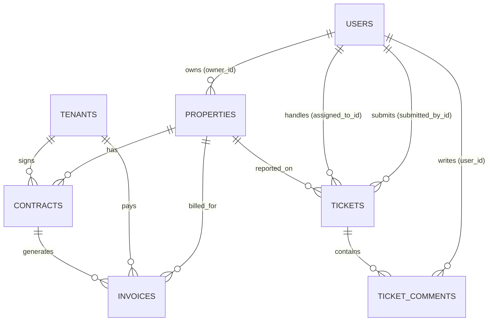

# 🗄️ Skema Database PropTrack

PropTrack menggunakan sistem database relasional dengan **SQLite** sebagai penggerak lokal utama. Sebagian besar entitas inti menggunakan kunci utama (**Primary Key**) bertipe **UUID (Universally Unique Identifier)** untuk integritas data terdistribusi dan isolasi yang kuat antara frontend SPA dan backend API.

---

## 🗺️ Diagram Hubungan Entitas (ERD)

Berikut adalah visualisasi hubungan antar tabel utama di dalam sistem PropTrack:

---

## 📊 Detail Struktur Tabel & Kolom

### 1. Tabel `users`
Tabel dasar autentikasi pengguna. Peran (*Role-based Access Control*) dikelola secara terpisah melalui paket `spatie/laravel-permission` (tabel gabungan `roles`, `permissions`, `model_has_roles`, dll.).

| Kolom | Tipe Data | Nullable | Default | Deskripsi / Relasi |
| :--- | :--- | :--- | :--- | :--- |
| `id` | BigInteger (PK) | No | Auto-increment | ID unik pengguna |
| `name` | String (255) | No | - | Nama lengkap pengguna |
| `email` | String (255) | No | - | Email unik pengguna (digunakan untuk login) |
| `email_verified_at` | Timestamp | Yes | NULL | Waktu verifikasi email |
| `password` | String (255) | No | - | Hash password (BCrypt) |
| `remember_token` | String (100) | Yes | NULL | Token sesi remember-me |
| `created_at` / `updated_at` | Timestamp | Yes | NULL | Rekam jejak audit waktu |

---

### 2. Tabel `properties`
Menyimpan informasi portofolio unit properti (kos, ruko, apartemen).

| Kolom | Tipe Data | Nullable | Default | Deskripsi / Relasi |
| :--- | :--- | :--- | :--- | :--- |
| `id` | UUID (PK) | No | - | ID unik properti |
| `owner_id` | BigInteger (FK) | No | - | Relasi ke `users.id` (pemilik unit) |
| `name` | String (255) | No | - | Nama properti (misal: "Kos Harmoni") |
| `address` | String (255) | No | - | Alamat fisik properti |
| `type` | String | No | - | Tipe unit: `kos`, `apartment`, `ruko` |
| `status` | String | No | `'available'` | Status unit: `available`, `occupied`, `maintenance` |
| `latitude` | Decimal (10, 8) | No | - | Koordinat lintang peta |
| `longitude` | Decimal (11, 8) | No | - | Koordinat bujur peta |
| `description` | Text | Yes | NULL | Deskripsi tambahan atau fasilitas unit |
| `monthly_price` | BigInteger | No | - | Harga sewa per bulan dalam rupiah (IDR) |
| `created_at` / `updated_at` | Timestamp | Yes | NULL | Rekam jejak audit waktu |

---

### 3. Tabel `tenants`
Profil biodata resmi penyewa. Tabel ini sinkron dengan tabel `users` berdasarkan alamat `email` untuk pencocokan sesi login.

| Kolom | Tipe Data | Nullable | Default | Deskripsi / Relasi |
| :--- | :--- | :--- | :--- | :--- |
| `id` | UUID (PK) | No | - | ID unik profil penyewa |
| `name` | String (255) | No | - | Nama lengkap penyewa |
| `email` | String (255) | No | - | Email penyewa (Unique) |
| `phone` | String (20) | No | - | Nomor WhatsApp aktif (untuk notifikasi Fonnte) |
| `id_card_number` | String (16) | No | - | Nomor KTP Indonesia (16 digit) |
| `emergency_contact_name` | String (255) | No | - | Nama kontak darurat |
| `emergency_contact_phone` | String (20) | No | - | Nomor HP kontak darurat |
| `created_at` / `updated_at` | Timestamp | Yes | NULL | Rekam jejak audit waktu |

---

### 4. Tabel `contracts`
Kontrak sewa resmi yang mengaitkan Penyewa (`tenants`) dengan Properti (`properties`).

| Kolom | Tipe Data | Nullable | Default | Deskripsi / Relasi |
| :--- | :--- | :--- | :--- | :--- |
| `id` | UUID (PK) | No | - | ID unik kontrak sewa |
| `tenant_id` | UUID (FK) | No | - | Relasi ke `tenants.id` (Penyewa) |
| `property_id` | UUID (FK) | No | - | Relasi ke `properties.id` (Unit Properti) |
| `start_date` | Date | No | - | Tanggal mulai kontrak sewa |
| `end_date` | Date | No | - | Tanggal berakhir kontrak sewa |
| `monthly_rent` | UnsignedBigInteger | No | - | Nominal sewa bulanan disepakati (Rupiah) |
| `deposit_amount` | UnsignedBigInteger | No | - | Nominal uang jaminan/deposit disepakati |
| `billing_date` | UnsignedTinyInteger | No | - | Tanggal jatuh tempo penagihan setiap bulan (1–28) |
| `status` | Enum | No | `'active'` | Status kontrak: `active`, `expired`, `terminated` |
| `terminated_at` | Timestamp | Yes | NULL | Tanggal terminasi dini kontrak (jika dihentikan paksa) |
| `created_at` / `updated_at` | Timestamp | Yes | NULL | Rekam jejak audit waktu |

**Aturan Bisnis Kunci:**
1. Hanya diperbolehkan maksimal **satu kontrak berstatus `active`** untuk satu `property_id` tertentu pada waktu yang sama. Validasi ini diproteksi oleh `ContractService::assertNoActiveContractForProperty()`.

---

### 5. Tabel `invoices`
Tagihan bulanan yang diterbitkan berdasarkan kontrak aktif.

| Kolom | Tipe Data | Nullable | Default | Deskripsi / Relasi |
| :--- | :--- | :--- | :--- | :--- |
| `id` | UUID (PK) | No | - | ID unik invoice |
| `contract_id` | UUID (FK) | No | - | Relasi ke `contracts.id` |
| `tenant_id` | UUID (FK) | No | - | Relasi ke `tenants.id` |
| `property_id` | UUID (FK) | No | - | Relasi ke `properties.id` |
| `invoice_number` | String (20) | No | - | Nomor unik tagihan (Unique, format: `INV-YYYY-NNNN`) |
| `status` | Enum | No | `'unpaid'` | Status pembayaran: `unpaid`, `paid`, `overdue`, `cancelled` |
| `amount` | UnsignedBigInteger | No | - | Jumlah tagihan sewa (Rupiah) |
| `billing_month` | String (7) | No | - | Bulan penagihan (format: `YYYY-MM`, misal: `"2026-06"`) |
| `due_date` | Date | No | - | Batas akhir pembayaran sewa |
| `paid_at` | Timestamp | Yes | NULL | Tanggal/waktu pelunasan sukses |
| `payment_gateway` | String (255) | Yes | NULL | Penyedia gerbang pembayaran (misal: `midtrans`) |
| `payment_token` | String (255) | Yes | NULL | Snap token transaksi dari Midtrans |
| `created_at` / `updated_at` | Timestamp | Yes | NULL | Rekam jejak audit waktu |

**Batasan Khusus (Constraints):**
- **Indeks Unik Komposit**: Kombinasi `['contract_id', 'billing_month']` disetel sebagai **Unique**. Ini menjamin tidak ada duplikasi tagihan bulanan untuk kontrak yang sama di bulan penagihan yang sama.

---

### 6. Tabel `tickets`
Keluhan pemeliharaan atau administrasi yang diajukan oleh penyewa.

| Kolom | Tipe Data | Nullable | Default | Deskripsi / Relasi |
| :--- | :--- | :--- | :--- | :--- |
| `id` | UUID (PK) | No | - | ID unik tiket keluhan |
| `ticket_number` | String (255) | No | - | Nomor unik tiket (Unique, format: `TKT-YYYY-NNNN`) |
| `property_id` | UUID (FK) | No | - | Relasi ke `properties.id` |
| `submitted_by_id` | BigInteger (FK) | No | - | Relasi ke `users.id` (Penyewa pengirim) |
| `assigned_to_id` | BigInteger (FK) | Yes | NULL | Relasi ke `users.id` (Agen/Admin penanggung jawab) |
| `category` | String (255) | No | - | Kategori tiket: `maintenance`, `billing`, `other` |
| `priority` | String (255) | No | - | Tingkat prioritas: `low`, `medium`, `high` |
| `status` | String (255) | No | `'open'` | Status penyelesaian: `open`, `in_progress`, `resolved`, `closed` |
| `title` | String (255) | No | - | Judul ringkasan keluhan |
| `description` | Text | No | - | Detail lengkap keluhan |
| `created_at` / `updated_at` | Timestamp | Yes | NULL | Rekam jejak audit waktu |

---

### 7. Tabel `ticket_comments`
Utas obrolan kronologis di dalam setiap tiket keluhan.

| Kolom | Tipe Data | Nullable | Default | Deskripsi / Relasi |
| :--- | :--- | :--- | :--- | :--- |
| `id` | UUID (PK) | No | - | ID unik komentar |
| `ticket_id` | UUID (FK) | No | - | Relasi ke `tickets.id` |
| `user_id` | BigInteger (FK) | No | - | Relasi ke `users.id` (Penulis komentar) |
| `content` | Text | No | - | Isi pesan balasan |
| `created_at` / `updated_at` | Timestamp | Yes | NULL | Rekam jejak audit waktu |

---

### 8. Tabel Sistem Lainnya

- **`notifications`**: Tabel bawaan Laravel Database Notification untuk mencatat riwayat notifikasi feed lonceng pengguna.
- **`media`**: Tabel bawaan dari paket `spatie/laravel-medialibrary` untuk mengelola data gambar/foto properti yang terunggah.
- **`jobs` & `failed_jobs`**: Tabel antrean asinkronus (Queue) untuk menangani pengiriman WhatsApp Gateway Fonnte, pengiriman surel, dan render dokumen PDF tanpa membebani thread HTTP utama.
- **Tabel Otorisasi Spatie (`roles`, `permissions`, `model_has_roles`, dll.)**: Menyimpan konfigurasi kontrol akses berbasis peran (RBAC) di PropTrack.
